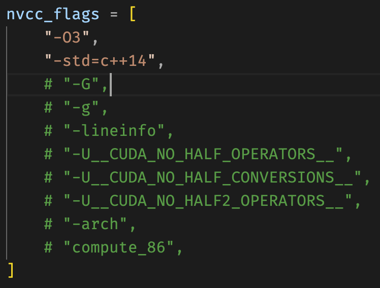

## Updates

[2023.6.21] I found the reason that the original program is slow: I forgot to turn off the debug flags during training:

The commented code in the above fig are enabled when I was using NVIDIA Nsight Compute. They damage the performance dramatically and should be commented during actual training.